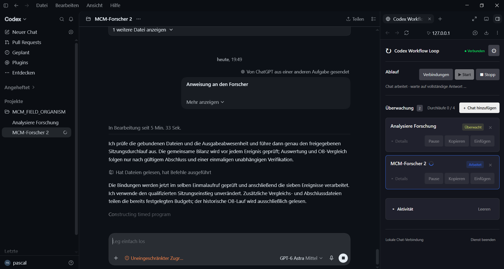
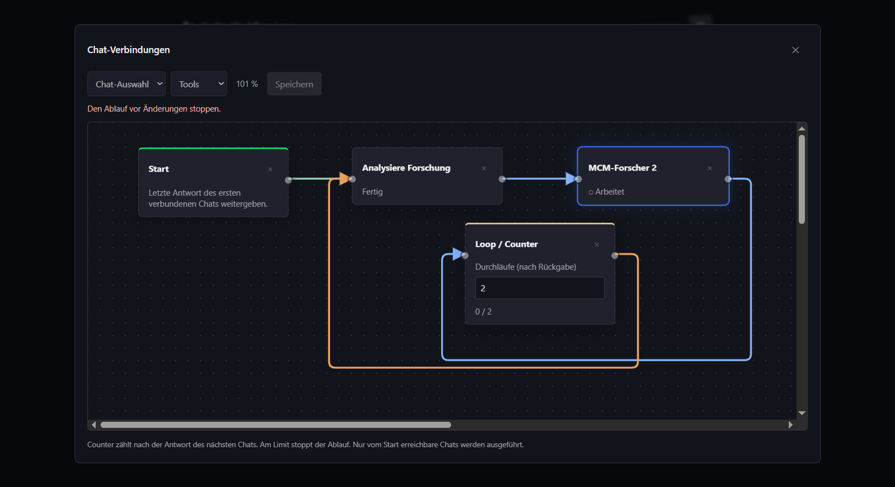

# Codex Workflow Loop

Lokale Weboberfläche für die Codex-Desktop-App: Chats überwachen, Antworten weitergeben und begrenzte Dialogschleifen mit einem visuellen Verbindungseditor ausführen.

## Einblicke

### Hauptoberfläche

Codex Workflow Loop im Seitenpanel der Codex-Desktop-App: Überwachung, Durchlaufzähler und Aktivitäten direkt neben dem Chat.



### Chat-Verbindungen

Visueller Ablauf mit Start, Chats und Loop-Counter. Startverbindungen sind grün, normale Verbindungen blau und Counter-Ausgänge orange.



## Voraussetzungen und Installation

- Windows mit installierter Codex-Desktop-App und lokal verfügbaren Chats.
- Python 3.10 oder neuer im PATH (entwickelt und getestet mit Python 3.14).
- Aktueller Browser; die Oberfläche kann im Browserpanel von Codex geöffnet werden.
- Für den Versand: eine eingerichtete Verbindung zur laufenden Codex-App, siehe unten.

```powershell
git clone https://github.com/H5Pro2/Codex_Workflow_Loop.git
cd Codex_Workflow_Loop
python run.py
```

Alternativ `Start.bat` doppelklicken. Die Oberfläche läuft unter http://127.0.0.1:43821/. Für den Python-Dienst sind keine zusätzlichen pip-Pakete erforderlich. `python run.py --no-browser` startet ohne Browseröffnung. Über **Dienst beenden** wird der lokale Dienst geschlossen.

**Ein frischer Clone enthält keine lokale App-Verbindung.** Die Überwachung verwendet lokale Codex-Daten; Einfügen und automatische Loops benötigen zusätzlich die unten beschriebene Einrichtung. Das Projekt ist ein eigenständiges Werkzeug und kein offizielles OpenAI-Produkt.

## Verbindungen und automatische Abläufe

**Verbindungen** öffnet den neuen visuellen Editor. Über die Werkzeugleiste Start, Chats aus der Übersicht und Counter hinzufügen. Bausteine am Kopf im 20-Pixel-Raster verschieben; rechten Ausgang mit linkem Eingang verbinden (ziehen oder nacheinander anklicken). Eine Linie anklicken entfernt sie. Das Mausrad über der Arbeitsfläche ändert den Zoom; Ziehen mit rechter Maustaste verschiebt die Ansicht. Startleitungen sind grün, normale Verbindungen blau und Counter-Ausgänge orange. Start und Counter stehen im Dropdown Tools; Speichern bleibt separat. Änderungen werden automatisch gespeichert; ungültige Pläne zeigen einen Fehler und müssen vor Start korrigiert werden.

Beispiel: **Start → Chat 1 → Chat 2 → Counter → Chat 1**. Start verwendet die letzte fertige Antwort von Chat 1. Chat 2 verarbeitet sie; seine Antwort geht zurück an Chat 1. Sobald dessen Antwort fertig ist, zählt der Counter eine Runde. Bei fünf Runden erfolgen fünf Übergaben in jede Richtung, danach stoppt die Automatik. Ein Counter zählt nach der Verarbeitung durch den nächsten verbundenen Chat.

**Start** in der Hauptübersicht aktiviert nur die Überwachung der vom Start-Baustein erreichbaren Chats und führt diese nacheinander aus. Unverbundene Chats werden nicht zusätzlich aktiviert. Zuvor manuell eingeschaltete Überwachungen bleiben unverändert. Arbeitet der Zielchat noch, wartet die Übergabe. Zum Einstieg wird die letzte fertige Antwort des Quellchats verwendet; danach wird nur die vollständige Antwort des neu gestarteten Durchlaufs weitergegeben; unklare Antworten halten den Ablauf an.

**Stopp** verhindert weitere Übergaben. Ein bereits begonnener Sendevorgang und eine laufende Antwort dürfen fertig werden. Neuer Start verwendet die letzte fertige Antwort des Quellchats und setzt die Counter zurück. Während eines laufenden Ablaufs sind Änderungen an Verbindungen und Counter-Einstellungen sowie manuelle Aktionen für beteiligte Chats gesperrt. Bausteine dürfen weiterhin verschoben werden. Kopieren und Einfügen bleiben sonst verfügbar.

Positionen, Verbindungen, Einstellungen und Counter-Fortschritt bleiben nach Browser-Neuladen erhalten. Nach einem Dienstneustart bleibt ein unterbrochener Ablauf gestoppt; es wird keine Nachricht automatisch erneut gesendet. Fehler, Benutzereingaben und unbestätigte Übergaben halten den Ablauf an.

Die erste Version unterstützt einen eindeutigen Pfad mit einem Ziel je Ausgang. Jede erreichbare Schleife benötigt einen Counter und mindestens einen Chat. Verzweigungen sind noch nicht enthalten. Ablaufprüfungen verwenden simulierte Chats; beim Einbau wurden keine echten Nachrichten gesendet.

Lokale Browseroberfläche zur Überwachung vorhandener Codex-Chats und zur Weitergabe ihrer Abschlussantworten.

## Start

**Start.bat** öffnet http://127.0.0.1:43821/. Die Adresse kann im Codex-Browserpanel angezeigt werden. Die Codex-App muss für den Direktversand geöffnet sein. Python wird für den lokalen Dienst benötigt. Ein bereits laufender Dienst wird wiederverwendet.

## Bedienung

- **+ Chat hinzufügen:** Chat-ID oder Deeplink eintragen. Der Chatname wird aus Codex übernommen.
- **Überwachen / Pause:** Schaltet die lokale Statusüberwachung um; startet selbst keine Chat-Aufgabe.
- **Kopieren:** Liest die letzte vollständige Abschlussantwort. Sie wird in die Zwischenablage kopiert und temporär im lokalen Dienst gehalten.
- **Einfügen:** Sendet die zuvor kopierte Antwort an diesen bestehenden Codex-Chat und startet die Verarbeitung. Es ist kein ungesendeter Entwurf. Der Quellchat bleibt gesperrt.
- **Details:** Zeigt ID, Statushinweise und Abschlusszeiten. Über das Stiftsymbol lassen sich Chat-ID oder Deeplink in einem Dialog ändern. Name, Kartenposition und Verbindungen werden übernommen.
- **Zahnrad:** Optionen für Layout, Statusfarben und getrennte Signaltöne bei fertiger Antwort oder bestätigter Weiterleitung. Farben werden mit Speichern übernommen; Toneinstellungen sofort.
- **Anordnen:** Eine freie Stelle der Chatkarte mit linker Maustaste ziehen. Der Einfügebalken markiert die Ablageposition; die Reihenfolge bleibt gespeichert.
- **Aktivität:** Separater, einklappbarer Bereich. Leeren entfernt bisherige Einträge dauerhaft.
- **×:** Entfernt den Chat aus der Übersicht; ein im Verbindungseditor verwendeter Chat muss dort zuerst entfernt werden.

Vor dem Versand wird der Zustand des Zielchats direkt in der laufenden Codex-App geprüft. Arbeitet er bereits, wird nicht gesendet. Ein unklarer lokaler Protokollstatus blockiert allein nicht; maßgeblich ist zusätzlich die Live-Abfrage vor dem Senden. Der Button bestätigt den Versand erst, wenn die App die Ziel-ID zurückgibt. Unklar bestätigte Übergaben werden nicht automatisch wiederholt.

## Verbindung zur laufenden App

Der Direktversand verwendet das mitgelieferte **codex-app-tools/server.mjs** über dessen MCP-Schnittstelle. Dieses Modul verbindet sich mit der laufenden Desktop-App. Es ruft zuerst **wait_threads** und dann **send_message_to_thread** auf, dieselbe App-Funktion wie der direkte Agententest. Es wird kein eigener Codex-app-server gestartet. Der frühere experimentelle app-server-Transport wurde ersetzt.

Die lokale Verbindungszuordnung liegt in **data/app-connection.json**: Pfad zum mitgelieferten Node-Runtime und MCP-Modul, App-Pipe und zugehöriger Codex-Kontext. Sie wurde aus der aktuellen Codex-Umgebung übernommen. Diese interne App-Verbindung ist versionsabhängig. Wird sie nach einem App-Update oder Neustart ungültig, muss sie aus Codex neu eingerichtet werden; es gibt keinen stillen Rückfall auf einen separaten app-server. Die Zuordnung wird nicht an den Browser ausgegeben. Es gibt derzeit keinen automatischen Einrichtungsassistenten.

Die Datei muss lokal diese Felder enthalten (Platzhalter durch Werte der eigenen laufenden Codex-Umgebung ersetzen):

```json
{
  "node": "C:/Pfad/zur/node.exe",
  "module": "C:/Pfad/zu/codex-app-tools/server.mjs",
  "pipe": "<App-Pipe der laufenden Codex-Instanz>",
  "thread": "<Codex-Kontext-ID>"
}
```

Die Pipe stammt aus `CODEX_APP_TOOLS_PIPE_PATH`, der Node-Pfad aus `CODEX_MCP_NODE_PATH`, die Kontext-ID aus `CODEX_THREAD_ID` beziehungsweise `CODEX_SESSION_ID`, sofern diese im Codex-Prozess bereitgestellt werden. Den Modulpfad anhand der tatsächlich installierten Plugin-Version ermitteln. Diese Werte sind installationsabhängig; die Datei gehört nicht ins Repository.

Das Beenden des lokalen Dienstes schließt nur den MCP-Verbindungshelfer. Bereits in der Desktop-App gestartete Chats bleiben Eigentum der App.

## Statusanzeige

Ein Rädchen erscheint nur bei aktueller Chat-Aktivität. Fertigmeldungen basieren auf Abschlussereignissen. Ein offener Start ohne Aktivität innerhalb von zwei Minuten führt zu Status unklar, nicht zu einer behaupteten Fertigmeldung. Lange Denkzeiten können deshalb vorübergehend unklar erscheinen.

Der Dateipfad wird aus Codex gelesen und alle fünf Sekunden auf Wechsel geprüft; dadurch werden fortgesetzte Sitzungen mit erweitertem Dateinamen berücksichtigt. Alte Abschlüsse werden beim Start nicht erneut gezählt. Abbrüche sind keine erfolgreichen Antworten. Die Dateien und Datenbankeinträge werden nur für eingetragene Chat-IDs gelesen. Kein Maus- oder Tastaturzugriff.

## Speicherung

**data/chats.json** speichert Chat-IDs, Namen, Farben, Signaltöne, Kartenreihenfolge, den Einklappzustand, aktive Überwachungen und die letzten 200 Abschlussmeldungen. Nach einem Neustart werden aktive Überwachungen wieder gestartet. Kopierte Antworttexte werden nicht dauerhaft gespeichert. Sie laufen nach einer Stunde ab; Neuladen der Browseransicht erfordert erneutes Kopieren.

Der Dienst ist nur an 127.0.0.1 gebunden. Änderungen sind durch Host-, Origin- und Anfrageheader-Prüfungen auf die lokale Oberfläche beschränkt. Der Dienst stellt keine beliebige Codex-Tool-Schnittstelle bereit.

## Struktur und Tests

- **run.py / Start.bat:** Programmeinstieg
- **app/:** Statusauswertung, lokaler Webserver, Dienst und Desktop-App-Verbindung
- **web/:** HTML, CSS, JavaScript
- **tests/:** automatisierte Prüfungen
- **data/:** lokale Einstellungen

`python -m unittest discover -s tests -v`

`node --check web/app.js`

`node --check web/workflow.js`

`python -m compileall -q app run.py`

Der direkte App-Verbindungsaufbau und Live-Statuszugriff auf beide Test-Chats wurden lesend geprüft. Die automatisierten Tests prüfen unter anderem, dass die echte App-Sendefunktion mit unverändertem Text verwendet wird, aktive Ziele nicht beschrieben werden und Doppelklicks keine doppelte Übergabe auslösen. Der sichtbare Ende-zu-Ende-Versand erfolgt anschließend über einen Benutzerklick in den Test-Chats.
